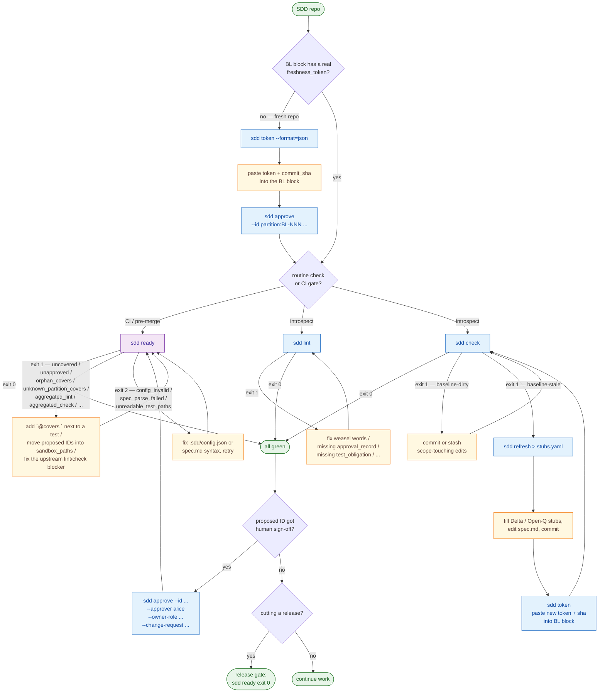

# `sdd-cli`

[](https://github.com/cyberash-dev/sdd-cli/actions/workflows/ci.yml)
[](LICENSE)
[](package.json)

A standalone CLI helper for Spec-Driven Development (SDD). Computes a
deterministic `freshness_token` over a configurable Discovery scope of
your repository, compares the current state against the value recorded
in your spec's Brownfield-baseline block, emits machine-readable stubs
(`Delta` / `Open-Q`) describing scope drift since the recorded
baseline commit, runs SDD spec-lint rules over normative IDs, flips
`lifecycle.status` from `proposed` to `approved` with a typed
`approval_record` block via `sdd approve`, and gates merges with the
single `sdd ready` command — a strict superset of `sdd lint` and
`sdd check` plus marker-coverage / sandbox-isolation checks for the
SDD `implementation-valid` gate-3.

The CLI is **mostly read-only on the spec**: `sdd token`, `sdd check`,
`sdd refresh`, `sdd lint`, `sdd ready` never rewrite normative
content. The single exception is `sdd approve`, which atomically
writes `lifecycle.status` + `approval_record` and refuses agent
identities (SDD §7.5: self-approval is forbidden).

> **Status**: v1.0.0, governed by `spec/spec.md`. The full normative
> specification (Surfaces, Behaviors, Contracts, Invariants, Policies,
> Constraints, External dependencies, Migrations, Deltas,
> Implementation bindings) lives there. This README is the
> consumer-facing manual — for spec details, read `spec/spec.md`.
> Release notes: [CHANGELOG.md](CHANGELOG.md).
>
> **What's new in v1.0.0** — sync to SDD methodology Plan 2: two-step
> approval (`sdd approve` → `.sdd/plans/<plan_id>.yaml` attestation,
> then `sdd finalize` for the atomic flip with prospective graph
> validation), `sdd report --pr-summary`, debt-budget mechanics on
> `Partition` (`unmodeled_budget`), semver cascade in `sdd ready`
> (Policy / Invariant(contractual) → referencing Surface).
> Legacy direct-rewrite path survives one minor as
> `sdd approve --inline` (deprecated; removed in v1.1.0).

---

## Why `sdd-cli`?

SDD treats a project's specification as the single source of truth for
code generation. The Brownfield-baseline block in `spec.md` records:

- `freshness_token` — a hash over the repository's Discovery scope at
  some commit;
- `baseline_commit_sha` — the commit at which the token was computed.

A `freshness_token` lets the SDD `baseline-valid` gate verify that the
spec's baseline still describes the actual repository. Without a
mechanical token, an agent has no way to detect that the source tree
drifted from the baseline since the last review.

`sdd-cli` provides these subcommands — the first six automate the
freshness/spec loop, `sdd record` navigates the spec, and `sdd install`
distributes the methodology rules into your agent config:

| Command       | Purpose                                                            |
|---------------|--------------------------------------------------------------------|
| `sdd token`   | Compute the current scope token at `HEAD` (no spec read).          |
| `sdd check`   | Compare the current token against the value recorded in `spec.md`. |
| `sdd refresh` | Diff scope state against the recorded baseline, emit stubs.        |
| `sdd lint`    | Run SDD spec-lint rules over your `lint.spec_files`; exit 1 on errors. |
| `sdd approve` | Promote a `proposed` ID to `approved` with a typed `approval_record`. Refuses agent identities (SDD §7.5). |
| `sdd ready`   | The single CI gate-3 (`implementation-valid`) check: marker coverage, sandbox isolation, lint + check aggregation. |
| `sdd record`  | Navigate/edit `spec.md` one record at a time (read-only `list`/`get`; atomic `set`/`add` for draft/proposed). |
| `sdd install` | Install the SDD methodology rules (+ Claude hooks) into the user-level agent config (`~/.claude`, `~/.codex`). |

The mechanism is fixed (`git_tree_hash_v1`), but the tool is generic:
every SDD-following repo configures it through a small JSON file
(`.sdd/config.json`).

---

## Requirements

- **Node.js** ≥ 20
- **git** ≥ 2.30 on `PATH`
- a git repository — the CLI refuses to run outside one

---

## Installation

### Option 1 — npm registry (recommended)

```sh
npm install --save-dev @cyberash/sdd-cli
```

After install, `sdd` is on `node_modules/.bin/sdd` and runnable via
`npx sdd ...` or your preferred package script.

### Option 2 — local path

When developing `sdd-cli` itself alongside a consumer repo:

```sh
npm install --save-dev "file:../sdd-cli"
```

`package.json` will reference `"@cyberash/sdd-cli": "file:../sdd-cli"`.
This is the recommended layout when both repos sit side by side, since
edits in `sdd-cli/` are picked up immediately after `npm run build`.

### Option 3 — `npm pack` tarball

For a frozen artefact without registry access:

```sh
# inside ~/Projects/sdd-cli
npm run build
npm pack                              # produces cyberash-sdd-cli-<version>.tgz

# inside the consumer repo
npm install --save-dev /path/to/cyberash-sdd-cli-1.0.0.tgz
```

---

## Configuration — `.sdd/config.json`

Drop a single JSON file at `<repo_root>/.sdd/config.json`. Minimal
example:

```json
{
  "$schema": "https://github.com/cyberash-dev/sdd-cli/blob/main/schema/sdd.config.schema.json",
  "spec_file": "spec/spec.md",
  "baseline_id": "my-partition:BL-001",
  "discovery_scope": [
    "src",
    "tests",
    "package.json",
    "tsconfig.json"
  ],
  "mechanism": "git_tree_hash_v1"
}
```

### Field reference

| Field                       | Type      | Required | Default                | Meaning                                                                 |
|-----------------------------|-----------|----------|------------------------|-------------------------------------------------------------------------|
| `spec_file`                 | string    | yes      | —                      | Path to the SDD spec file, relative to repo root.                       |
| `baseline_id`               | string    | yes      | —                      | Full `<partition>:BL-<n>` of the BrownfieldBaseline block to read.      |
| `discovery_scope`           | string[]  | yes      | —                      | git pathspecs (dirs, files, globs) handed verbatim to `git ls-tree`.    |
| `mechanism`                 | enum      | yes      | —                      | Currently only `"git_tree_hash_v1"`.                                    |
| `footprint.binding_id_prefix` | string  | no       | `"IMP-"`               | Neutral-id prefix scanned for footprint paths.                          |
| `footprint.binding_field`   | string    | no       | `"binding"`            | YAML key under which file paths live in IMP blocks.                     |
| `lint.spec_files`           | string[]  | no       | `[spec_file]`          | Glob patterns (posix) for spec files to scan with `sdd lint`/`sdd approve`. |
| `lint.approver_blocklist`   | string[]  | no       | `[]`                   | Extra approver identities to refuse on top of the built-in agent list.  |
| `partitions`                | object    | no       | absent → flat shorthand | Multi-partition mode (CTR-015). Per-partition `spec_paths` (required), `test_paths`, `sandbox_paths`. Keys match the partition-name regex below. |
| `test_paths` (top-level)    | string[]  | no       | `[]`                   | Shorthand applied to the synthesised single-partition fallback when `partitions` is absent. |
| `sandbox_paths` (top-level) | string[]  | no       | `[]`                   | Shorthand applied to the synthesised single-partition fallback when `partitions` is absent. |

`baseline_id` and `partitions.<name>` keys both match
`^[a-z][a-z0-9-]*(:[a-z][a-z0-9-]*)*$` (one or more lowercase tokens
joined by `:`; CST-007 / CTR-015 widening). Examples:
`pipeline-driver:BL-001`, `bridge:commands:CON-004`. Single-segment is
the v0.1.0/v0.2.0 default and is preserved unchanged. Unknown
top-level fields are rejected — see `schema/sdd.config.schema.json`
for the formal JSON Schema.

### Discovery scope tips

- A scope entry that resolves to **zero files** at HEAD is a hard
  config error. This protects against typos like
  `spec/0[0-9]-*.md` when no such files exist yet.
- Globs use git pathspec syntax (`*`, `?`, `[abc]`). They resolve
  against `git ls-tree -r --name-only HEAD`.
- Order does not matter: `git ls-tree` canonicalises by name, so the
  resulting token is stable across reorderings.

---

## The Brownfield-baseline block

`sdd-cli` looks up a single YAML block in `<spec_file>` whose `id`
equals `<config.baseline_id>` and whose `type` equals
`BrownfieldBaseline`. It reads two fields from that block:

```yaml
---
id: my-partition:BL-001
type: BrownfieldBaseline
freshness_token: <64-char hex>
baseline_commit_sha: <40-char hex>
mechanism: git_tree_hash_v1
# ... lifecycle, discovery_scope, coverage_evidence, etc.
---
```

The CLI treats duplicate baseline blocks (same `id` matching twice) as
a config error.

---

## Commands

### `sdd token`

Compute and print the current scope token at `HEAD`.

```sh
sdd token                      # human format
sdd token --format=json        # machine-readable
```

**JSON output (success)**:

```json
{
  "format_version": 1,
  "ok": true,
  "token": "e3b0c44298fc1c149afbf4c8996fb92427ae41e4649b934ca495991b7852b855",
  "commit_sha": "0b0f4d84e5c7a9182f15c7f3d4e0f6a8c0e1d2b7",
  "mechanism": "git_tree_hash_v1",
  "scope": ["src", "tests", "package.json"]
}
```

**JSON output (scope-dirty)**:

```json
{
  "format_version": 1,
  "ok": false,
  "reason": "baseline-dirty",
  "dirty_paths": ["src/foo.ts"]
}
```

`sdd token` exits **1** when the working tree is dirty inside scope —
the CLI never computes a token over uncommitted changes. Untracked
files inside scope count as dirt.

### `sdd check`

Compare the freshly computed token against the value recorded in the
baseline block.

```sh
sdd check                      # human format
sdd check --format=json
```

**Outcomes**:

| Exit | Reason             | Meaning                                                            |
|------|--------------------|--------------------------------------------------------------------|
| 0    | —                  | Recorded token matches the recomputed one; tree is scope-clean.    |
| 1    | `baseline-stale`   | Tree is clean, but the recorded token differs from the recomputed. |
| 1    | `baseline-dirty`   | Working tree has uncommitted scope changes; check short-circuits.  |

`sdd check` is the typical CI gate. If you put it in a pre-merge or
pre-deploy pipeline, exit code 1 stops the build until either the spec
is refreshed (with `sdd refresh` and human review) or the working tree
is cleaned up.

### `sdd refresh`

Diff the current scope state against the recorded `baseline_commit_sha`
and emit one stub per drifted path.

```sh
sdd refresh                    # default: --format=yaml
sdd refresh --format=json
sdd refresh --format=human
```

Each changed path is bucketed:

- **Inside an `IMP-*` footprint** → `Delta` stub naming the IMP-id(s)
  whose `binding` covers that path, plus the IMP's `target_ids`. A
  human or downstream agent fills in `compatibility_action`,
  `kind_of_change`, `tests_old_behavior`, `tests_new_behavior`.
- **Inside scope but outside every footprint** → `Open-Q` stub asking
  whether the path should be bound to a normative ID.

**YAML stream** (default):

```yaml
---
kind: Delta
path: "src/foo.ts"
target_imp_ids:
  - "my-partition:IMP-002"
target_ids:
  - "my-partition:BEH-014"
emitted_at: "2026-04-29T15:37:35.000Z"
compatibility_action: TODO
kind_of_change: TODO
tests_old_behavior: TODO
tests_new_behavior: TODO
---
kind: Open-Q
path: "spec/notes.md"
question: "Should spec/notes.md be bound to a normative ID?"
options:
  - "bind_to_existing_or_new_id"
  - "leave_unmodeled"
blocking: TODO
emitted_at: "2026-04-29T15:37:35.000Z"
```

**Empty drift in JSON mode**:

```json
{ "format_version": 1, "stubs": [] }
```

`sdd refresh` exits **0** even when stubs are emitted — the command is
composable in scripts (`sdd refresh > stubs.yaml`). The drift signal is
`sdd check`, not `sdd refresh`.

### `sdd lint`

Run SDD spec-lint rules over every file matched by `lint.spec_files`
(falling back to the single `spec_file` when the `lint` block is
absent). Lint never modifies the spec.

```sh
sdd lint                     # human format (default)
sdd lint --format=json
```

Each violating ID record produces one diagnostic. Rule ids (e.g.
`sdd:weasel-word`, `sdd:approval-record-required`,
`sdd:test-obligation-required`) are append-only — once published, a
rule id is never renamed or repurposed.

**JSON envelope**:

```json
{
  "format_version": 1,
  "ok": false,
  "error_count": 3,
  "warn_count": 0,
  "diagnostics": [
    {
      "severity": "error",
      "rule": "sdd:approval-record-required",
      "file": "spec/spec.md",
      "line": 141,
      "message": "ID \"my:SUR-001\" has lifecycle.status=approved but no real approval_record (SDD §7.5)."
    }
  ]
}
```

| Exit | Meaning                                                                              |
|------|--------------------------------------------------------------------------------------|
| 0    | All errors resolved (warnings are allowed).                                          |
| 1    | At least one **error**-severity diagnostic. `ok: false` in JSON.                     |
| 2    | argv error (unknown flag, invalid format value).                                     |
| 3    | Environment error (e.g. `.sdd/config.json` missing).                                 |

### `sdd approve`

Promote one or more normative IDs from `proposed` (with the
`not_applicable_for_proposed` placeholder) to `approved` (or
`deprecated` / `removed`), writing a typed `approval_record` block in
the same atomic edit. The CLI refuses to run when the `--approver` is
in the built-in agent blocklist (e.g. `claude`, `bot:*`,
`spec-author-bot`, `sdd-cli`) or appears in
`lint.approver_blocklist`.

```sh
sdd approve \
  --id "my-partition:BEH-014" \
  --approver alice \
  --owner-role tech-lead \
  --change-request "https://example.com/pr/42"
```

**Required flags**: `--id`, `--approver`, `--owner-role`,
`--change-request`.

**Optional flags**:

- `--scope <string>` (default: `first-time-approval`)
- `--target-status approved|deprecated|removed` (default: `approved`)
- `--reviewed-test-oracle <ref>` (recommended for major-bump Surfaces)
- `--format json|human` (default: `human`)

`--id` accepts an exact id or a glob with `*` (e.g. `pol:*`). All
matching records in every file under `lint.spec_files` are rewritten
in one batch. The written `approval_record` block looks like:

```yaml
approval_record:
  owner_role: tech-lead
  approver_identity: alice
  timestamp: 2026-04-30T10:15:42.001Z
  change_request: https://example.com/pr/42
  scope: first-time-approval
```

| Exit | Reason                  | Meaning                                                                         |
|------|-------------------------|---------------------------------------------------------------------------------|
| 0    | —                       | At least one record matched and was rewritten.                                  |
| 1    | `agent-approver`        | `--approver` is in the built-in agent blocklist or starts with `bot:` (SDD §7.5). |
| 1    | `invalid-owner-role`    | `--owner-role` is not in the closed enum (six allowed roles).                   |
| 1    | `no-id-match`           | `--id`/glob matched zero normative-ID records across all spec files.            |
| 2    | —                       | argv error (missing required flag, unknown flag, invalid `--target-status`).    |

**Owner-role enum** (closed): `tech-lead`, `architect`,
`security-owner`, `platform-runtime-lead`, `product-owner`,
`compliance`.

### `sdd ready`

Single, authoritative gate-3 check for CI. Strict superset of
`sdd lint` and `sdd check`: scans for `@covers <partition>:<id>`
markers in your test files, refuses `proposed`/`draft` IDs outside
`sandbox_paths`, demands a typed `compatibility_action=…` marker for
`removed` IDs, and re-runs lint/check semantics under one JSON
envelope. Adding `sdd ready` to your protected-branch policy is what
makes the SDD three-gate contract enforceable in practice.

```sh
sdd ready                              # default: all partitions, human output
sdd ready --format=json                # stable JSON for CI / GitHub annotations
sdd ready --partition pipeline-driver  # filter (and staged-rollout knob)
```

**Exit codes**:

| Exit | Meaning                                                                              |
|------|--------------------------------------------------------------------------------------|
| 0    | Mergeable. No blockers found.                                                        |
| 1    | At least one merge blocker found (any of the seven rule kinds, or aggregated).       |
| 2    | Could not evaluate (`config_invalid` / `spec_parse_failed` / `unreadable_test_paths`). |

**Marker grammar** (CST-007): `@covers <partition>:<id> [key=value ...]`
where `<partition>` matches
`^[a-z][a-z0-9-]*(:[a-z][a-z0-9-]*)*$` (one or more lowercase tokens
joined by `:` — single-segment `my-partition:BEH-001` and multi-segment
`bridge:commands:CON-004` both parse), `<id>` matches `^[A-Z]+-\d+$`,
and the only whitelisted tail key in v0.3.0 is
`compatibility_action=<value>`. Unknown tail keys are silently
ignored (forward-compat). The partition/id split is at the rightmost
`:` of the captured token (the id tail contains no `:`). Place
markers anywhere in your test files — typically as
`// @covers <id>` near the test that closes the obligation.

**Configuring partitions** (CTR-015): the v0.1.0/v0.2.0 flat
`.sdd/config.json` shape is preserved as a single-partition shorthand
when `partitions` is absent. For multi-partition repos, declare:

```json
{
  "partitions": {
    "my-partition": {
      "spec_paths": ["spec/spec.md"],
      "test_paths": ["tests/**/*.test.ts"],
      "sandbox_paths": ["spike/**"]
    }
  }
}
```

A cross-partition test that legitimately covers IDs from both A and
B must appear in **both** partitions' `test_paths`. Implicit
cross-credit is not provided.

> `sdd ready` verifies traceability presence, not test fidelity.
> Major-bump correctness (oracle/assertion summary, input classes,
> negative oracle) is human review per SDD §three gates.

### `sdd record`

Navigate and edit a large `spec.md` one record at a time, without
reading or rewriting the whole file — designed for AI agents whose
context window is the scarce resource. Four subcommands:

```sh
sdd record list                           # compact index of every record
sdd record list --partition my-partition  # filter to one partition
sdd record get my-partition:BEH-001        # one record, verbatim
sdd record set my-partition:BEH-001 --from-file body.yaml
sdd record set my-partition:BEH-001 --content "$BODY"
sdd record add --after my-partition:BEH-001 --from-file new.yaml
```

- **`list`** — one row per record: `id` · `type` · `lifecycle.status` ·
  derived title (the record's `title`, else a Surface's `name`, else
  blank). `--partition <name>` keeps only records whose partition
  component (the id minus its trailing `:<ID-tail>`) equals `<name>`.
  Read-only.
- **`get <id>`** — prints the record's exact source body (round-trips
  straight back into `set`). `--format=json` adds `file`,
  `start_line`, `end_line`. Exit 1 if the id is not found.
- **`set <id>`** — replaces the body of an existing **`draft`/`proposed`**
  record in place; the surrounding fence and `---` markers are
  preserved. The body comes from `--from-file <path>` or `--content
  <string>`, supplied either bare (as `get` emits) or wrapped in a
  ```` ```yaml ```` fence — both are normalised.
- **`add --after <id>`** — inserts a new ```` ```yaml ````-fenced record
  immediately after the anchor's fence. The body's `id` must be new and
  its status `draft`/`proposed`.

`set`/`add` **refuse `approved`/`deprecated`/`removed` records** (exit
1) — changing a governed record is a `Delta` + `sdd approve`/`sdd
finalize` job. The write is atomic (temp-file + rename) and touches
only the `lint.spec_files` file that holds the record; everything else
in the file, plus `.sdd/config.json` and `.git/`, is left byte-identical
(`INV-015`). `list`/`get` never write at all (`INV-002`). Run `sdd lint`
after any `set`/`add` — the body is spliced verbatim, so lint remains
the structural gate.

**Exit codes**: 0 success · 1 `record-not-found` / `anchor-not-found` /
`duplicate-id` / `record-protected` / get-miss · 2 `invalid-body`
(no `id:`, unparseable, both/neither input flag, or set id≠body id).

### `sdd install`

Make `sdd-cli` the distribution point for the SDD methodology rules
(shipped under `rules/`). Installs them into the **user-level** agent
config so any project can follow the discipline.

```sh
sdd install all                 # both targets below
sdd install claude              # ~/.claude
sdd install codex               # ~/.codex
sdd install all --dry-run       # print the planned file ops, write nothing
sdd install claude --format=json
```

What lands per target:

- **`claude`** — the minimal TDD+SDD context rules are copied to
  `~/.claude/sdd/` and `@import`-ed from a managed block in
  `~/.claude/CLAUDE.md`; the full reference is installed as an on-demand
  skill at `~/.claude/skills/spec-driven-development/SKILL.md`; and two
  `PreToolUse` hooks are merged into `~/.claude/settings.json` — a lint
  reminder and a **spec-read guard** that denies reading `spec/*.md` in
  any project carrying `.sdd/config.json` (forcing `sdd record` instead).
- **`codex`** — every rule is copied to `~/.codex/sdd/` and listed in a
  managed block in `~/.codex/AGENTS.md` (Codex has no `@import` / hook
  host, so hooks are reported as skipped).

The artifact set is data-driven by `rules/manifest.json` (`CST-008`).
Install is **idempotent** (managed blocks are replaced in place, hook
entries deduped by matcher+command, pre-existing user hooks preserved)
and the only command that writes outside the repo: only under the agent
home roots, never inside `<repo_root>` (`INV-016` / `POL-003`).
`$SDD_INSTALL_HOME` overrides the home root.

| Exit | Reason              | Meaning                                              |
|------|---------------------|------------------------------------------------------|
| 0    | —                   | Install (or `--dry-run` plan) completed.             |
| 1    | `manifest-missing` / `manifest-invalid` / `artifact-missing` | A packaged rule file or the manifest could not be read; nothing is written. |
| 2    | —                   | argv error (missing/unknown target, unknown flag).   |

### Output formats summary

| Subcommand    | `human`        | `json` | `yaml` |
|---------------|----------------|--------|--------|
| `sdd token`   | yes (default)  | yes    | —      |
| `sdd check`   | yes (default)  | yes    | —      |
| `sdd refresh` | yes            | yes    | yes (default) |
| `sdd lint`    | yes (default)  | yes    | —      |
| `sdd approve` | yes (default)  | yes    | —      |
| `sdd ready`   | yes (default)  | yes    | —      |
| `sdd record`  | yes (default)  | yes    | —      |
| `sdd install` | yes (default)  | yes    | —      |

JSON outputs carry `format_version: 1` and are stable per the
contracts in `spec/spec.md` §7. Human-format output is a one-line
summary plus indented detail; it omits the `emitted_at` timestamp.

---

## Exit code taxonomy

```
0  clean / success
1  drift (baseline-stale OR baseline-dirty); refresh-with-stubs is NOT 1
2  configuration error
3  environment error
```

| Code | Reason                          | Where it can come from                             |
|------|---------------------------------|----------------------------------------------------|
| 0    | —                               | Successful run.                                    |
| 1    | `baseline-dirty`                | Scope-touching uncommitted changes.                |
| 1    | `baseline-stale`                | Recorded token does not match recomputed.          |
| 2    | `config-missing`                | `.sdd/config.json` does not exist.                 |
| 2    | `config-invalid`                | Schema violation, bad JSON, baseline_commit_sha unresolvable, zero-match scope glob, etc. |
| 2    | `baseline-block-missing`        | Spec has no block with `id == config.baseline_id`. |
| 2    | `baseline-block-duplicate`      | Spec has multiple blocks with the same `id`.       |
| 3    | `git-not-on-path`               | `git` binary not on `PATH`.                        |
| 3    | `not-a-git-repo`                | cwd is not inside a git working tree.              |
| 3    | `head-unborn`                   | Repo exists but `HEAD` does not resolve.           |
| 1    | `agent-approver`                | `sdd approve` refuses when `--approver` is an agent identity. |
| 1    | `invalid-owner-role`            | `sdd approve` refuses an unknown `--owner-role`.   |
| 1    | `no-id-match`                   | `sdd approve` refuses when `--id`/glob matched no records. |

Reasons are stable strings — downstream tooling can pin against them.

---

## Token mechanism — `git_tree_hash_v1`

```
1. git diff --quiet HEAD -- <scope>          # if non-zero -> baseline-dirty (exit 1)
2. git ls-tree HEAD -- <scope>               # capture stdout bytes verbatim
3. token = hex(sha256(stdout_bytes))
4. commit_sha = trim(stdout of `git rev-parse HEAD`)
5. emit { token, commit_sha, mechanism, scope }
```

Determinism comes from git's canonical `ls-tree` output: for a fixed
commit and pathspec set, the bytes are identical across invocations on
the same git version family. Reordering scope entries does not change
the token, because git canonicalises by name.

The set of git subcommands used by `sdd-cli` is a strict allowlist:
`diff --quiet HEAD`, `ls-tree HEAD`, `rev-parse HEAD`,
`rev-parse --is-inside-work-tree`, `diff --name-only baseline..HEAD`,
`status --porcelain`. No state-mutating subcommand is ever invoked
(see `spec/spec.md` POL-002).

---

## Workflow at a glance

Two views on the same loop: a flowchart for the full lifecycle, and a
lookup table for "I know my situation, just give me the command".
Detailed step-by-step scenarios live in [Typical workflows](#typical-workflows)
below.

### The SDD loop



Read the chart in four layers:

1. **Bootstrap** (left branch off `Q1`) — one-time, when the
   Brownfield-baseline block still has placeholder values. Compute the
   token, paste it in, approve the BL record with a human identity,
   confirm `sdd check` is green.
2. **CI / pre-merge** (`Q2 → RDY`) — `sdd ready` is the single
   authoritative gate. It is a strict superset of `sdd lint` and
   `sdd check`: re-runs both under one JSON envelope, plus enforces
   marker coverage (`@covers <id>`), sandbox isolation for `proposed`
   IDs, and `compatibility_action=…` markers for `removed` IDs. Add
   `sdd ready` to your protected-branch policy and you do not need
   to wire `sdd lint` and `sdd check` separately.
3. **Introspection** (`Q2 → L` / `Q2 → C`) — when you want a focused
   answer to one question (just spec rules, just scope freshness),
   the dedicated commands are still useful for narrowing diagnostics.
4. **Drift response** (right branch off `C`) — when `sdd check`
   reports `baseline-stale`, `sdd refresh` emits one stub per drifted
   path. After a human fills the stubs and updates the spec, recompute
   the token with `sdd token` and re-record it in the BL block.

Approval (`A`) is human-only by design (SDD §7.5: `sdd approve`
refuses agent identities). It is a transition from `proposed` to
`approved` on a normative ID, never a way to bypass `sdd ready` (or
`sdd lint` / `sdd check` underneath).

### When to run which command

| Situation                                                       | Command(s)                                                                                                                                          |
|-----------------------------------------------------------------|-----------------------------------------------------------------------------------------------------------------------------------------------------|
| Fresh repo, BrownfieldBaseline still has placeholders            | `sdd token` → paste token + commit_sha → `sdd approve --id <part>:BL-NNN ...` → `sdd check`                                                       |
| **Pre-merge / pre-deploy CI gate**                              | **`sdd ready`** (strict superset of `sdd lint` + `sdd check` — single command, one JSON envelope)                                                  |
| **Pre-release sanity check**                                    | **`sdd ready`**                                                                                                                                     |
| Introspect: does the spec follow SDD rules?                      | `sdd lint`                                                                                                                                          |
| Introspect: did anything in scope drift since baseline?          | `sdd check`                                                                                                                                         |
| `sdd ready` flags `[uncovered]`                                 | add `// @covers <partition>:<id>` next to a test that closes the obligation, or set `Test obligation: not_applicable + reason` in the spec          |
| `sdd ready` flags `[unapproved]`                                | promote via `sdd approve …` (with a human identity), or move the proposed ID's spec file into `partitions[*].sandbox_paths`                          |
| `sdd ready` flags `[unknown_partition_covers]`                  | add the partition to `.sdd/config.json#partitions`, or fix the marker prefix on the offending line                                                  |
| `sdd check` reports `baseline-dirty`                             | `git commit` or `git stash` your scope-touching working-tree edits, then re-run `sdd check` (or `sdd ready`)                                         |
| `sdd check` reports `baseline-stale`                             | `sdd refresh > stubs.yaml` → fill `Delta` / `Open-Q` stubs into the spec → commit → `sdd token` → paste fresh token + commit_sha → `sdd check`     |
| Reviewer signed off on a `proposed` ID                           | `sdd approve --id ... --approver <human> --owner-role ... --change-request <url>` → `sdd ready`                                                     |
| Inspect the current scope token without touching the spec        | `sdd token` (or `sdd token --format=json` for piping)                                                                                               |

> All commands are read-only on the spec **except `sdd approve`**,
> which atomically rewrites `lifecycle.status` + `approval_record`
> (INV-002 / INV-007). `sdd refresh` writes only to stdout — apply its
> stubs by hand.

---

## Typical workflows

### 1 — bootstrapping a new SDD baseline

You have a repo with a spec, but no `freshness_token` yet.

```sh
# 1. add config + an empty BrownfieldBaseline block in spec.md.
#    leave freshness_token / baseline_commit_sha as placeholders.

# 2. compute the real token at the current HEAD.
sdd token --format=json
#   {"token":"<TOKEN>","commit_sha":"<SHA>", ... }

# 3. paste TOKEN and SHA into the BL-001 block in spec.md.
#    commit. add a non-agent approval_record to BL-001.

# 4. confirm the baseline is consistent.
sdd check
#   exit 0
```

### 2 — daily / CI gate

Wire `sdd check` into the gate that decides whether code is allowed to
move from `spec-valid` to `implementation-valid`.

```yaml
# example GitHub Actions step
- run: npx sdd check
```

If `sdd check` exits 1, either:

- the working tree is dirty (commit your changes), or
- a scope-touching commit landed since the recorded baseline (run
  `sdd refresh` and update the spec).

### 3 — a scope-touching change has landed

After committing a code change, `sdd check` reports
`baseline-stale`. You now know the spec needs an update — but the
spec is the source of truth, so you cannot just re-record the new
token. Instead:

```sh
sdd refresh > /tmp/stubs.yaml
```

For every changed path, the CLI emits exactly one stub:

- a `Delta` stub if the path lives inside an existing IMP footprint —
  fill in `compatibility_action`, `kind_of_change`, and the test
  references, then add the stub to your spec's `Deltas` section;
- an `Open-Q` stub if the path is in scope but no IMP claims it —
  decide whether to bind it to an existing/new normative id, or to
  leave it unmodeled.

After the spec edits land, recompute the token:

```sh
sdd token --format=json | jq -r .token       # paste into BL-001.freshness_token
sdd token --format=json | jq -r .commit_sha  # paste into BL-001.baseline_commit_sha
```

…and `sdd check` is green again.

### 4 — `sdd ready` as the single CI gate

`sdd ready` is the one command CI should call. It is a strict superset
of `sdd lint` and `sdd check`: re-runs both under a single JSON
envelope (kinds `aggregated_lint` / `aggregated_check`), and on top
adds gate-3 (`implementation-valid`) checks — every
`approved`/`deprecated` normative ID must have ≥ 1 test annotated
`@covers <partition>:<id>`, every `removed` ID must have a matching
`compatibility_action=…` marker, no `proposed`/`draft` ID may live
outside `partitions[*].sandbox_paths`, and orphan/unknown-partition
markers surface as `[orphan_covers]` / `[unknown_partition_covers]`.

```yaml
- run: npx sdd ready
```

Wiring `sdd ready` into a protected-branch policy is what makes the
SDD three-gate contract enforceable in practice. You no longer need
to wire `sdd lint` and `sdd check` separately — both run inside
`sdd ready`. They remain useful for narrowing diagnostics during
local development.

`sdd ready` exits 0 (mergeable), 1 (blocker — see the violation
list), or 2 (`config_invalid` / `spec_parse_failed` /
`unreadable_test_paths`, i.e. the gate could not even evaluate).

### 5 — promoting a `proposed` ID to `approved`

When a human reviewer signs off on an ID (a Behavior, Contract,
Invariant, Surface, etc.), they switch its lifecycle from `proposed`
to `approved` and stamp the typed `approval_record` block. `sdd
approve` does this in one atomic edit and refuses agent identities
(SDD §7.5: self-approval is forbidden).

```sh
sdd approve \
  --id "my-partition:BEH-014" \
  --approver alice \
  --owner-role tech-lead \
  --change-request "https://example.com/pr/42"

# `sdd approve` rewrites:
#   lifecycle.status: approved
#   approval_record:
#     owner_role: tech-lead
#     approver_identity: alice
#     timestamp: 2026-04-30T10:15:42.001Z
#     change_request: https://example.com/pr/42
#     scope: first-time-approval
```

If `--approver` is in the built-in agent blocklist (e.g. `claude`,
`codex`, `bot:tg-1`, `sdd-cli` itself) the command exits 1 with reason
`agent-approver` and writes nothing.

After approval, run `sdd ready` to verify the record now passes
`sdd:approval-record-required` and that gate-3 (the test annotated
`@covers` for the just-approved ID) is in place.

### 6 — confirming a release

Right before tagging a release, `sdd ready` should be exit 0. That
single signal means: spec rules pass, the recorded baseline is fresh,
every approved ID has a `@covers` test, no `proposed`/`draft` ID
slipped outside `sandbox_paths`, and the working tree is clean.
Releases without that signal break SDD's invariant that "spec is the
source of truth".

---

## Architecture

`sdd-cli` follows Vertical Slice + Hexagonal architecture. Each
command (`token`, `check`, `refresh`, `lint`, `approve`, `ready`) owns
its own slice with local domain, application, ports, and adapters. The
composition root is `src/cli.ts`.

```
src/
  cli.ts                      # argv router / DI
  features/
    token/
      domain/                 # —
      application/            # ComputeToken
      ports/{inbound,outbound}/
      adapters/{inbound,outbound}/   # CliTokenHandler, ChildProcessTokenGit, NodeTokenConfigReader
    check/
      domain/                 # BaselineComparison
      application/            # CheckBaseline
      ports/{inbound,outbound}/
      adapters/{inbound,outbound}/
    refresh/
      domain/                 # Footprint, DiffStubs
      application/            # BuildRefreshStubs
      ports/{inbound,outbound}/
      adapters/{inbound,outbound}/
    lint/
      domain/                 # Diagnostic, Record, SpecParser, Rules
      application/            # RunLint
      ports/{inbound,outbound}/
      adapters/{inbound,outbound}/
    approve/
      domain/                 # ApproveRequest (incl. BUILTIN_AGENT_BLOCKLIST), Rewrite
      application/            # ApplyApproval
      ports/{inbound,outbound}/
      adapters/{inbound,outbound}/
    ready/
      domain/                 # MarkerParser (CST-007), PartitionResolver, Rules (8 rule fns)
      application/            # RunReady — strict superset of lint + check
      ports/{inbound,outbound}/
      adapters/{inbound,outbound}/
  shared/
    domain/                   # Config (incl. LintConfig + partitions), Token, SpecBlocks,
                              # Scope, CliOutput, Errors, PartitionGrammar (CST-007 source of truth),
                              # SpecRecord, LintReport, LintRules, CheckOutcome
```

Cross-feature imports are forbidden and enforced by
`tests/unit/layer-imports.test.ts` (per `INV-004`). Shared primitives
live only under `src/shared/domain`.

---

## Development

```sh
git clone <repo>
cd sdd-cli
npm install

npm run tsc                  # type-check (no emit)
npm run test:unit
npm run test:integration
npm run build                # tsc + chmod +x dist/cli.js
node dist/cli.js --help
```

The integration suite spins up tmp git repos and runs the built CLI.
`tests/integration/git-shim-allowlist.test.ts` enforces POL-002 (only
EXT-001-allowlisted git subcommands), and
`tests/integration/fs-readonly.test.ts` enforces INV-002 / POL-001
(spec, config, and git refs/objects unchanged after each run).

`tests/integration/package-bin.test.ts` runs `npm pack` end-to-end and
installs the tarball into a fresh consumer to verify the `bin` wiring
(CTR-007). Allow ~2 minutes for that test on the first run.

---

## Limits / out of scope (v0.3.0)

- npm-registry publication of `@cyberash/sdd-cli`.
- Other token mechanisms (`sha256_of_concat`, `git_tag_based`).
- A scaffolding command (`sdd init`).
- Auto-application of `sdd refresh` stubs back into `spec.md`
  (forbidden by INV-002).
- Localised output / message catalogs.
- Lint/aggregated diagnostic on `@covers` near-misses (e.g. uppercase
  in partition prefix). v0.3.0 silently skips them — see
  [`OQ-017`](spec/spec.md) for the deferred decision.

`sdd lint` shipped in v0.2.0 and `sdd ready` shipped in v0.3.0 — both
are no longer out of scope. `sdd record` (read-only `list`/`get`, plus
`set`/`add` writing a single draft/proposed record) is the one
sanctioned writer of `spec.md` — the blanket "no auto-write" above is
specifically about `sdd refresh` stubs; record writes are governed by
`INV-015`. `sdd install` (`SUR-016`) is in scope and distinct from the
out-of-scope `sdd init` scaffolding: it writes the methodology rules and
Claude hooks into the user-level agent config, never into the repo
working tree (`INV-016` / `POL-003`).

---

## Documents in this repo

| File              | Purpose                                                                        |
|-------------------|--------------------------------------------------------------------------------|
| `spec/spec.md`    | The normative specification — single source of truth.                          |
| `README.md`       | Consumer manual (this file).                                                   |
| `CHANGELOG.md`    | Release notes per version, mapped to spec IDs.                                 |
| `RELEASING.md`    | How to cut a release and publish to npm.                                       |
| `CLAUDE.md`       | Project-specific instructions for Claude Code agents.                          |
| `AGENTS.md`       | Repo-rooted, agent-agnostic rules of the road for any AI coding agent.        |
| `LICENSE`         | MIT.                                                                           |
| `schema/sdd.config.schema.json` | Published JSON Schema for `.sdd/config.json`.                    |

---

## Contributing

This is a personal tool published for reuse. PRs are welcome but the
SDD discipline is enforced — every behavior change requires a
corresponding spec update in the same PR, `sdd lint` must exit 0, and
`sdd approve` is human-only (the CLI refuses agent identities). See
`AGENTS.md` for the rules an AI coding agent must follow when working
in this repo.

---

## Specification

The full normative specification — Surfaces, Behaviors, Contracts,
Invariants, Policies, Constraints, External dependencies, Generated
artefacts, Implementation bindings, Open questions, Assumptions — is
in `spec/spec.md`. If a behavior surprises you, that file is the
source of truth, and any divergence between code and spec is a bug.
