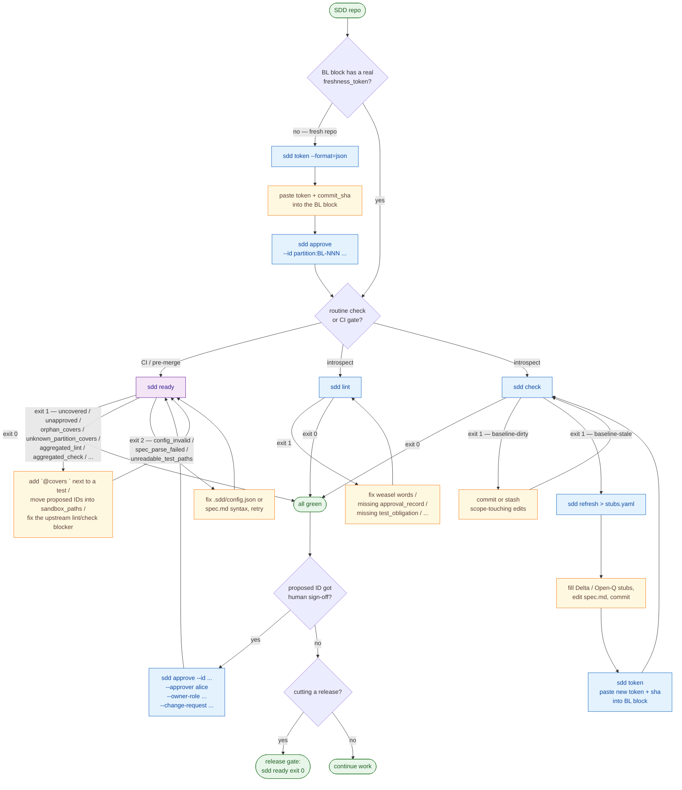

# `agent-sdd`

[](https://github.com/cyberash-dev/sdd-cli/actions/workflows/ci.yml)
[](LICENSE)
[](package.json)

📖 На других языках: [English](README.md)

Самостоятельный CLI-помощник для разработки на основе спецификации
(Spec-Driven Development, SDD). Вычисляет детерминированный
`freshness_token` по настраиваемой области обнаружения (Discovery scope)
вашего репозитория, сравнивает текущее состояние со значением,
записанным в блоке Brownfield-baseline спецификации, выдаёт
машиночитаемые заготовки (`Delta` / `Open-Q`), описывающие дрейф области
с момента зафиксированного базового коммита, прогоняет правила
SDD spec-lint по нормативным ID, переводит `lifecycle.status` из
`proposed` в `approved` с типизированным блоком `approval_record` через
`sdd approve` и закрывает мерджи единственной командой `sdd ready` —
строгим надмножеством `sdd lint` и `sdd check` плюс проверками покрытия
маркерами и изоляции песочницы для гейта `implementation-valid`
(gate-3) методологии SDD.

CLI **в основном работает со спецификацией только на чтение**: `sdd
token`, `sdd check`, `sdd refresh`, `sdd lint`, `sdd ready` никогда не
перезаписывают нормативное содержимое. Единственное исключение — `sdd
approve`, который атомарно записывает `lifecycle.status` +
`approval_record` и отказывается работать с агентскими идентичностями
(SDD §7.5: самоутверждение запрещено).

> **Статус**: v1.0.0, управляется `spec/spec.md`. Полная нормативная
> спецификация (Surfaces, Behaviors, Contracts, Invariants, Policies,
> Constraints, External dependencies, Migrations, Deltas,
> Implementation bindings) находится там. Этот README — руководство для
> потребителя; за деталями спецификации читайте `spec/spec.md`.
> Заметки о релизах: [CHANGELOG.md](CHANGELOG.md).
>
> **Что нового в v1.0.0** — синхронизация с Plan 2 методологии SDD:
> двухшаговое утверждение (`sdd approve` → аттестация в
> `.sdd/plans/<plan_id>.yaml`, затем `sdd finalize` для атомарного
> переключения с проспективной проверкой графа), `sdd report
> --pr-summary`, механика бюджета долга на `Partition`
> (`unmodeled_budget`), каскад semver в `sdd ready` (Policy /
> Invariant(contractual) → ссылающийся Surface). Устаревший путь прямой
> перезаписи доживает один минор как `sdd approve --inline` (deprecated;
> удаляется в v1.1.0).

---

## Зачем `agent-sdd`?

SDD рассматривает спецификацию проекта как единственный источник истины
для генерации кода. Блок Brownfield-baseline в `spec.md` записывает:

- `freshness_token` — хеш по области обнаружения репозитория на
  некотором коммите;
- `baseline_commit_sha` — коммит, на котором был вычислен токен.

`freshness_token` позволяет гейту `baseline-valid` методологии SDD
проверить, что базовая линия спецификации всё ещё описывает реальный
репозиторий. Без механического токена у агента нет способа обнаружить,
что дерево исходников ушло от базовой линии с момента последнего
ревью.

`sdd-cli` предоставляет следующие подкоманды — первые шесть
автоматизируют цикл свежести/спецификации, `sdd record` навигирует по
спецификации, а `sdd install` распространяет правила методологии в
конфигурацию вашего агента:

| Команда       | Назначение                                                         |
|---------------|--------------------------------------------------------------------|
| `sdd token`   | Вычислить текущий токен области на `HEAD` (без чтения спецификации). |
| `sdd check`   | Сравнить текущий токен со значением, записанным в `spec.md`.        |
| `sdd refresh` | Сравнить состояние области с базовой линией, выдать заготовки.       |
| `sdd lint`    | Прогнать правила SDD spec-lint по `lint.spec_files`; код 1 при ошибках. |
| `sdd approve` | Перевести `proposed` ID в `approved` с типизированным `approval_record`. Отказывает агентским идентичностям (SDD §7.5). |
| `sdd ready`   | Единственная проверка gate-3 (`implementation-valid`) для CI: покрытие маркерами, изоляция песочницы, агрегация lint + check. |
| `sdd record`  | Навигация/правка `spec.md` по одной записи (только чтение `list`/`get`; атомарные `set`/`add` для draft/proposed). |
| `sdd install` | Установить правила методологии SDD (+ хуки Claude) в конфигурацию агента уровня пользователя (`~/.claude`, `~/.codex`) либо в репозиторий через `--scope project`. |

Механизм зафиксирован (`git_tree_hash_v1`), но инструмент универсален:
каждый следующий SDD репозиторий настраивает его через небольшой
JSON-файл (`.sdd/config.json`).

---

## Требования

- **Node.js** ≥ 20
- **git** ≥ 2.30 в `PATH`
- git-репозиторий — вне репозитория CLI запускаться отказывается

---

## Установка

### Вариант 1 — реестр npm (рекомендуется)

```sh
npm install --save-dev agent-sdd
```

После установки `sdd` доступен по пути `node_modules/.bin/sdd` и
запускается через `npx sdd ...` или ваш предпочтительный скрипт пакета.

### Вариант 2 — локальный путь

При разработке самого `sdd-cli` рядом с потребляющим репозиторием:

```sh
npm install --save-dev "file:../sdd-cli"
```

`package.json` будет ссылаться на `"agent-sdd": "file:../sdd-cli"`.
Это рекомендуемая компоновка, когда оба репозитория лежат рядом,
поскольку правки в `sdd-cli/` подхватываются сразу после `npm run
build`.

### Вариант 3 — тарбол `npm pack`

Для замороженного артефакта без доступа к реестру:

```sh
# внутри ~/Projects/sdd-cli
npm run build
npm pack                              # создаёт agent-sdd-<version>.tgz

# внутри потребляющего репозитория
npm install --save-dev /path/to/agent-sdd-1.0.0.tgz
```

---

## Конфигурация — `.sdd/config.json`

Положите один JSON-файл по пути `<repo_root>/.sdd/config.json`.
Минимальный пример:

```json
{
  "$schema": "https://github.com/cyberash-dev/sdd-cli/blob/main/schema/sdd.config.schema.json",
  "spec_file": "spec/spec.md",
  "baseline_id": "my-partition:BL-001",
  "discovery_scope": [
    "src",
    "tests",
    "package.json",
    "tsconfig.json"
  ],
  "mechanism": "git_tree_hash_v1"
}
```

### Справочник полей

| Поле                        | Тип       | Обязательно | По умолчанию           | Значение                                                                |
|-----------------------------|-----------|-------------|------------------------|-------------------------------------------------------------------------|
| `spec_file`                 | string    | да          | —                      | Путь к файлу спецификации SDD относительно корня репозитория.           |
| `baseline_id`               | string    | да          | —                      | Полный `<partition>:BL-<n>` блока BrownfieldBaseline для чтения.         |
| `discovery_scope`           | string[]  | да          | —                      | git pathspec (каталоги, файлы, globs), передаются дословно в `git ls-tree`. |
| `mechanism`                 | enum      | да          | —                      | Сейчас только `"git_tree_hash_v1"`.                                     |
| `footprint.binding_id_prefix` | string  | нет         | `"IMP-"`               | Префикс нейтрального id, сканируемый на пути footprint.                  |
| `footprint.binding_field`   | string    | нет         | `"binding"`            | YAML-ключ, под которым лежат пути к файлам в блоках IMP.                 |
| `lint.spec_files`           | string[]  | нет         | `[spec_file]`          | Glob-шаблоны (posix) для файлов спецификации, сканируемых `sdd lint`/`sdd approve`. |
| `lint.approver_blocklist`   | string[]  | нет         | `[]`                   | Дополнительные идентичности утверждающих, отклоняемые поверх встроенного списка агентов. |
| `partitions`                | object    | нет         | отсутствует → плоская сокращённая форма | Режим нескольких партиций (CTR-015). Для каждой партиции `spec_paths` (обязательно), `test_paths`, `sandbox_paths`. Ключи соответствуют regex имени партиции ниже. |
| `test_paths` (верхнего уровня)    | string[]  | нет   | `[]`                   | Сокращение, применяемое к синтезированной однопартиционной запасной форме, когда `partitions` отсутствует. |
| `sandbox_paths` (верхнего уровня) | string[]  | нет   | `[]`                   | Сокращение, применяемое к синтезированной однопартиционной запасной форме, когда `partitions` отсутствует. |

Ключи `baseline_id` и `partitions.<name>` соответствуют
`^[a-z][a-z0-9-]*(:[a-z][a-z0-9-]*)*$` (один или более токенов в нижнем
регистре, соединённых `:`; расширение CST-007 / CTR-015). Примеры:
`pipeline-driver:BL-001`, `bridge:commands:CON-004`. Односегментная
форма — это умолчание v0.1.0/v0.2.0, оно сохраняется без изменений.
Неизвестные поля верхнего уровня отклоняются — см. формальную JSON Schema
в `schema/sdd.config.schema.json`.

### Советы по области обнаружения

- Запись области, которая разрешается в **ноль файлов** на HEAD, —
  жёсткая ошибка конфигурации. Это защищает от опечаток вроде
  `spec/0[0-9]-*.md`, когда таких файлов ещё нет.
- Globs используют синтаксис git pathspec (`*`, `?`, `[abc]`). Они
  разрешаются относительно `git ls-tree -r --name-only HEAD`.
- Порядок не важен: `git ls-tree` канонизирует по имени, поэтому
  итоговый токен стабилен при переупорядочивании.

---

## Блок Brownfield-baseline

`sdd-cli` ищет в `<spec_file>` один YAML-блок, у которого `id` равен
`<config.baseline_id>`, а `type` равен `BrownfieldBaseline`. Он читает
из этого блока два поля:

```yaml
---
id: my-partition:BL-001
type: BrownfieldBaseline
freshness_token: <64-char hex>
baseline_commit_sha: <40-char hex>
mechanism: git_tree_hash_v1
# ... lifecycle, discovery_scope, coverage_evidence и т. д.
---
```

Дублирующиеся базовые блоки (один и тот же `id` совпадает дважды) CLI
трактует как ошибку конфигурации.

---

## Команды

### `sdd token`

Вычислить и вывести текущий токен области на `HEAD`.

```sh
sdd token                      # человекочитаемый формат
sdd token --format=json        # машиночитаемый
```

**JSON-вывод (успех)**:

```json
{
  "format_version": 1,
  "ok": true,
  "token": "e3b0c44298fc1c149afbf4c8996fb92427ae41e4649b934ca495991b7852b855",
  "commit_sha": "0b0f4d84e5c7a9182f15c7f3d4e0f6a8c0e1d2b7",
  "mechanism": "git_tree_hash_v1",
  "scope": ["src", "tests", "package.json"]
}
```

**JSON-вывод (область грязная)**:

```json
{
  "format_version": 1,
  "ok": false,
  "reason": "baseline-dirty",
  "dirty_paths": ["src/foo.ts"]
}
```

`sdd token` завершается с кодом **1**, когда рабочее дерево грязное
внутри области — CLI никогда не вычисляет токен по незакоммиченным
изменениям. Неотслеживаемые файлы внутри области считаются грязью.

### `sdd check`

Сравнить свежевычисленный токен со значением, записанным в базовом
блоке.

```sh
sdd check                      # человекочитаемый формат
sdd check --format=json
```

**Исходы**:

| Код  | Причина            | Значение                                                           |
|------|--------------------|--------------------------------------------------------------------|
| 0    | —                  | Записанный токен совпадает с пересчитанным; дерево чистое в области. |
| 1    | `baseline-stale`   | Дерево чистое, но записанный токен отличается от пересчитанного.    |
| 1    | `baseline-dirty`   | В рабочем дереве есть незакоммиченные изменения области; проверка прерывается. |

`sdd check` — типичный CI-гейт. Если вы поставите его в пайплайн перед
мерджем или деплоем, код выхода 1 остановит сборку, пока спецификация не
будет обновлена (через `sdd refresh` и ревью человеком) либо рабочее
дерево не будет очищено.

### `sdd refresh`

Сравнить текущее состояние области с записанным `baseline_commit_sha` и
выдать по одной заготовке на каждый дрейфующий путь.

```sh
sdd refresh                    # по умолчанию: --format=yaml
sdd refresh --format=json
sdd refresh --format=human
```

Каждый изменённый путь раскладывается по корзинам:

- **Внутри footprint `IMP-*`** → заготовка `Delta`, называющая IMP-id,
  чей `binding` покрывает этот путь, плюс `target_ids` этого IMP. Человек
  или нижестоящий агент заполняет `compatibility_action`,
  `kind_of_change`, `tests_old_behavior`, `tests_new_behavior`.
- **Внутри области, но вне всех footprint** → заготовка `Open-Q`,
  спрашивающая, нужно ли привязать путь к нормативному ID.

**YAML-поток** (по умолчанию):

```yaml
---
kind: Delta
path: "src/foo.ts"
target_imp_ids:
  - "my-partition:IMP-002"
target_ids:
  - "my-partition:BEH-014"
emitted_at: "2026-04-29T15:37:35.000Z"
compatibility_action: TODO
kind_of_change: TODO
tests_old_behavior: TODO
tests_new_behavior: TODO
---
kind: Open-Q
path: "spec/notes.md"
question: "Should spec/notes.md be bound to a normative ID?"
options:
  - "bind_to_existing_or_new_id"
  - "leave_unmodeled"
blocking: TODO
emitted_at: "2026-04-29T15:37:35.000Z"
```

**Пустой дрейф в режиме JSON**:

```json
{ "format_version": 1, "stubs": [] }
```

`sdd refresh` завершается с кодом **0** даже когда выданы заготовки —
команда компонуема в скриптах (`sdd refresh > stubs.yaml`). Сигнал
дрейфа — это `sdd check`, а не `sdd refresh`.

### `sdd lint`

Прогнать правила SDD spec-lint по каждому файлу, совпавшему с
`lint.spec_files` (с откатом к единственному `spec_file`, когда блок
`lint` отсутствует). Lint никогда не модифицирует спецификацию.

```sh
sdd lint                     # человекочитаемый формат (по умолчанию)
sdd lint --format=json
```

Каждая запись ID, нарушающая правило, даёт один диагностический вывод.
ID правил (например, `sdd:weasel-word`,
`sdd:approval-record-required`, `sdd:test-obligation-required`) —
только-добавляемые: однажды опубликованный ID правила никогда не
переименовывается и не перенацеливается.

**JSON-конверт**:

```json
{
  "format_version": 1,
  "ok": false,
  "error_count": 3,
  "warn_count": 0,
  "diagnostics": [
    {
      "severity": "error",
      "rule": "sdd:approval-record-required",
      "file": "spec/spec.md",
      "line": 141,
      "message": "ID \"my:SUR-001\" has lifecycle.status=approved but no real approval_record (SDD §7.5)."
    }
  ]
}
```

| Код  | Значение                                                                             |
|------|--------------------------------------------------------------------------------------|
| 0    | Все ошибки устранены (предупреждения допускаются).                                    |
| 1    | Хотя бы один диагностический вывод уровня **error**. `ok: false` в JSON.              |
| 2    | Ошибка argv (неизвестный флаг, недопустимое значение format).                         |
| 3    | Ошибка окружения (например, отсутствует `.sdd/config.json`).                          |

### `sdd approve`

Перевести один или несколько нормативных ID из `proposed` (с
заглушкой `not_applicable_for_proposed`) в `approved` (либо
`deprecated` / `removed`), записав типизированный блок `approval_record`
в том же атомарном изменении. CLI отказывается работать, когда
`--approver` находится во встроенном списке блокировки агентов
(например, `claude`, `bot:*`, `spec-author-bot`, `sdd-cli`) или
присутствует в `lint.approver_blocklist`.

```sh
sdd approve \
  --id "my-partition:BEH-014" \
  --approver alice \
  --owner-role tech-lead \
  --change-request "https://example.com/pr/42"
```

**Обязательные флаги**: `--id`, `--approver`, `--owner-role`,
`--change-request`.

**Необязательные флаги**:

- `--scope <string>` (по умолчанию: `first-time-approval`)
- `--target-status approved|deprecated|removed` (по умолчанию: `approved`)
- `--reviewed-test-oracle <ref>` (рекомендуется для Surface с major-bump)
- `--format json|human` (по умолчанию: `human`)

`--id` принимает точный id или glob с `*` (например, `pol:*`). Все
совпадающие записи во всех файлах под `lint.spec_files` переписываются
одним пакетом. Записанный блок `approval_record` выглядит так:

```yaml
approval_record:
  owner_role: tech-lead
  approver_identity: alice
  timestamp: 2026-04-30T10:15:42.001Z
  change_request: https://example.com/pr/42
  scope: first-time-approval
```

| Код  | Причина                 | Значение                                                                        |
|------|-------------------------|---------------------------------------------------------------------------------|
| 0    | —                       | Хотя бы одна запись совпала и была переписана.                                   |
| 1    | `agent-approver`        | `--approver` во встроенном списке блокировки агентов или начинается с `bot:` (SDD §7.5). |
| 1    | `invalid-owner-role`    | `--owner-role` не входит в закрытый enum (шесть допустимых ролей).               |
| 1    | `no-id-match`           | `--id`/glob не совпал ни с одной записью нормативного ID во всех файлах спецификации. |
| 2    | —                       | Ошибка argv (отсутствует обязательный флаг, неизвестный флаг, недопустимый `--target-status`). |

**Enum роли владельца** (закрытый): `tech-lead`, `architect`,
`security-owner`, `platform-runtime-lead`, `product-owner`,
`compliance`.

### `sdd ready`

Единственная авторитетная проверка gate-3 для CI. Строгое надмножество
`sdd lint` и `sdd check`: сканирует маркеры `@covers <partition>:<id>`
в ваших тестовых файлах, отклоняет `proposed`/`draft` ID вне
`sandbox_paths`, требует типизированный маркер `compatibility_action=…`
для `removed` ID и перезапускает семантику lint/check под одним
JSON-конвертом. Добавление `sdd ready` в политику защищённой ветки —
это то, что делает трёхгейтовый контракт SDD обеспечиваемым на практике.

```sh
sdd ready                              # по умолчанию: все партиции, человекочитаемый вывод
sdd ready --format=json                # стабильный JSON для CI / аннотаций GitHub
sdd ready --partition pipeline-driver  # фильтр (и рычаг поэтапного развёртывания)
```

**Коды выхода**:

| Код  | Значение                                                                             |
|------|--------------------------------------------------------------------------------------|
| 0    | Можно мерджить. Блокеров не найдено.                                                  |
| 1    | Найден хотя бы один блокер мерджа (любой из семи видов правил, либо агрегированный).  |
| 2    | Не удалось оценить (`config_invalid` / `spec_parse_failed` / `unreadable_test_paths`). |

**Грамматика маркера** (CST-007): `@covers <partition>:<id> [key=value ...]`,
где `<partition>` соответствует
`^[a-z][a-z0-9-]*(:[a-z][a-z0-9-]*)*$` (один или более токенов в нижнем
регистре, соединённых `:` — и односегментный `my-partition:BEH-001`, и
многосегментный `bridge:commands:CON-004` парсятся), `<id>`
соответствует `^[A-Z]+-\d+$`, а единственный допустимый хвостовой ключ
в v0.3.0 — `compatibility_action=<value>`. Неизвестные хвостовые ключи
молча игнорируются (forward-compat). Разделение partition/id происходит
по самому правому `:` захваченного токена (хвост id не содержит `:`).
Размещайте маркеры где угодно в тестовых файлах — обычно как
`// @covers <id>` рядом с тестом, закрывающим обязательство.

**Настройка партиций** (CTR-015): плоская форма `.sdd/config.json` из
v0.1.0/v0.2.0 сохраняется как однопартиционное сокращение, когда
`partitions` отсутствует. Для многопартиционных репозиториев объявите:

```json
{
  "partitions": {
    "my-partition": {
      "spec_paths": ["spec/spec.md"],
      "test_paths": ["tests/**/*.test.ts"],
      "sandbox_paths": ["spike/**"]
    }
  }
}
```

Кросс-партиционный тест, который законно покрывает ID и из A, и из B,
должен присутствовать в `test_paths` **обеих** партиций. Неявного
кросс-зачёта нет.

> `sdd ready` проверяет наличие трассируемости, а не достоверность теста.
> Корректность major-bump (резюме оракула/утверждений, классы входов,
> негативный оракул) — это ревью человеком по SDD §three gates.

### `sdd record`

Навигация и правка большого `spec.md` по одной записи, без чтения или
перезаписи всего файла — спроектировано для AI-агентов, у которых
контекстное окно является дефицитным ресурсом. Четыре подкоманды:

```sh
sdd record list                           # компактный индекс всех записей
sdd record list --partition my-partition  # фильтр по одной партиции
sdd record get my-partition:BEH-001        # одна запись, дословно
sdd record set my-partition:BEH-001 --from-file body.yaml
sdd record set my-partition:BEH-001 --content "$BODY"
sdd record add --after my-partition:BEH-001 --from-file new.yaml
```

- **`list`** — по одной строке на запись: `id` · `type` ·
  `lifecycle.status` · производный заголовок (`title` записи, иначе
  `name` у Surface, иначе пусто). `--partition <name>` оставляет только
  записи, у которых компонент партиции (id за вычетом хвоста
  `:<ID-tail>`) равен `<name>`. Только чтение.
- **`get <id>`** — печатает точное тело записи в исходнике
  (round-trip обратно в `set`). `--format=json` добавляет `file`,
  `start_line`, `end_line`. Код 1, если id не найден.
- **`set <id>`** — заменяет тело существующей записи **`draft`/`proposed`**
  на месте; окружающий fence и маркеры `---` сохраняются. Тело берётся
  из `--from-file <path>` или `--content <string>`, переданное либо
  голым (как выдаёт `get`), либо обёрнутым в
  ```` ```yaml ```` fence — оба варианта нормализуются.
- **`add --after <id>`** — вставляет новую запись в
  ```` ```yaml ````-fence сразу после fence якоря. `id` тела должен быть
  новым, а его статус — `draft`/`proposed`.

`set`/`add` **отказываются работать с записями `approved`/`deprecated`/`removed`**
(код 1) — изменение управляемой записи — это задача `Delta` + `sdd
approve`/`sdd finalize`. Запись атомарна (временный файл + rename) и
затрагивает только файл из `lint.spec_files`, содержащий запись; всё
остальное в файле, плюс `.sdd/config.json` и `.git/`, остаётся
побайтово идентичным (`INV-015`). `list`/`get` вообще не пишут
(`INV-002`). Запускайте `sdd lint` после любого `set`/`add` — тело
вставляется дословно, поэтому lint остаётся структурным гейтом.

**Коды выхода**: 0 успех · 1 `record-not-found` / `anchor-not-found` /
`duplicate-id` / `record-protected` / промах get · 2 `invalid-body`
(нет `id:`, не парсится, оба/ни одного входного флага, или у set id≠id тела).

### `sdd install`

Сделать `sdd-cli` точкой распространения правил методологии SDD
(поставляются под `rules/`). Устанавливает их в конфигурацию агента
**уровня пользователя**, чтобы любой проект мог следовать дисциплине.

```sh
sdd install all                 # обе цели ниже
sdd install claude              # ~/.claude
sdd install codex               # ~/.codex
sdd install all --dry-run       # вывести запланированные файловые операции, ничего не писать
sdd install claude --format=json
sdd install all --scope project # писать в ЭТОТ репозиторий, а не в домашний каталог
```

`--scope user|project` (по умолчанию `user`) выбирает корень назначения:

- **`user`** (по умолчанию) — побайтово как раньше: пишет под `~/.claude`
  и `~/.codex` (`$SDD_INSTALL_HOME` переопределяет корень дома).
- **`project`** — пишет конфигурацию агента в текущий рабочий каталог,
  чтобы репозиторий нёс SDD-настройку для всей команды: `./CLAUDE.md` и
  `./AGENTS.md` в корне репозитория, а правила, навыки и `settings.json`
  под `./.claude/**` и `./.codex/**`. В project-режиме команды хуков в
  `settings.json` используют `$CLAUDE_PROJECT_DIR/.claude/sdd/...`, так что
  закоммиченный `settings.json` переносим между машинами. Project-режим
  пишет только этот набор конфигурации агента — никогда `spec/*.md`,
  `.sdd/config.json`, `.git` или исходники (`INV-016` / `POL-003` /
  `POL-001`).

Что появляется для каждой цели:

- **`claude`** — минимальные контекстные правила TDD+SDD копируются в
  `~/.claude/sdd/` и подключаются через `@import` из управляемого блока в
  `~/.claude/CLAUDE.md`; полная справка ставится как навык по требованию
  в `~/.claude/skills/spec-driven-development/SKILL.md`; и два хука
  `PreToolUse` сливаются в `~/.claude/settings.json` — напоминание о
  lint и **спец-страж чтения**, который запрещает читать `spec/*.md` в
  любом проекте, несущем `.sdd/config.json` (вынуждая использовать `sdd
  record`).
- **`codex`** — каждое правило копируется в `~/.codex/sdd/` и
  перечисляется в управляемом блоке в `~/.codex/AGENTS.md` (у Codex нет
  хоста для `@import` / хуков, поэтому хуки отмечаются как пропущенные).

Набор артефактов управляется данными из `rules/manifest.json`
(`CST-008`). Установка **идемпотентна** (управляемые блоки заменяются на
месте, записи хуков дедуплицируются по matcher+command, заранее
существующие пользовательские хуки сохраняются) и это единственная
команда, которая пишет вне репозитория: только под корнями домашних
каталогов агентов, никогда внутри `<repo_root>` (`INV-016` /
`POL-003`). `$SDD_INSTALL_HOME` переопределяет корень домашнего каталога.

| Код  | Причина             | Значение                                             |
|------|---------------------|------------------------------------------------------|
| 0    | —                   | Установка (или план `--dry-run`) завершена.          |
| 1    | `manifest-missing` / `manifest-invalid` / `artifact-missing` | Не удалось прочитать поставляемый файл правила или манифест; ничего не записывается. |
| 2    | —                   | Ошибка argv (отсутствует/неизвестная цель, неизвестный флаг). |

### Сводка форматов вывода

| Подкоманда    | `human`        | `json` | `yaml` |
|---------------|----------------|--------|--------|
| `sdd token`   | да (умолчание) | да     | —      |
| `sdd check`   | да (умолчание) | да     | —      |
| `sdd refresh` | да             | да     | да (умолчание) |
| `sdd lint`    | да (умолчание) | да     | —      |
| `sdd approve` | да (умолчание) | да     | —      |
| `sdd ready`   | да (умолчание) | да     | —      |
| `sdd record`  | да (умолчание) | да     | —      |
| `sdd install` | да (умолчание) | да     | —      |

JSON-выводы несут `format_version: 1` и стабильны согласно контрактам в
`spec/spec.md` §7. Человекочитаемый вывод — это однострочное резюме плюс
отступленная детализация; он опускает временную метку `emitted_at`.

---

## Таксономия кодов выхода

```
0  чисто / успех
1  дрейф (baseline-stale ИЛИ baseline-dirty); refresh-с-заготовками НЕ равен 1
2  ошибка конфигурации
3  ошибка окружения
```

| Код  | Причина                         | Откуда может прийти                                |
|------|---------------------------------|----------------------------------------------------|
| 0    | —                               | Успешный запуск.                                   |
| 1    | `baseline-dirty`                | Незакоммиченные изменения, затрагивающие область.  |
| 1    | `baseline-stale`                | Записанный токен не совпадает с пересчитанным.     |
| 2    | `config-missing`                | `.sdd/config.json` не существует.                  |
| 2    | `config-invalid`                | Нарушение схемы, плохой JSON, неразрешимый baseline_commit_sha, glob области с нулём совпадений и т. д. |
| 2    | `baseline-block-missing`        | В спецификации нет блока с `id == config.baseline_id`. |
| 2    | `baseline-block-duplicate`      | В спецификации несколько блоков с одинаковым `id`. |
| 3    | `git-not-on-path`               | Бинарь `git` не в `PATH`.                          |
| 3    | `not-a-git-repo`                | cwd не внутри рабочего дерева git.                 |
| 3    | `head-unborn`                   | Репозиторий есть, но `HEAD` не разрешается.        |
| 1    | `agent-approver`                | `sdd approve` отказывает, когда `--approver` — агентская идентичность. |
| 1    | `invalid-owner-role`            | `sdd approve` отказывает при неизвестном `--owner-role`. |
| 1    | `no-id-match`                   | `sdd approve` отказывает, когда `--id`/glob не совпал с записями. |

Причины — стабильные строки: нижестоящий инструментарий может на них
полагаться.

---

## Механизм токена — `git_tree_hash_v1`

```
1. git diff --quiet HEAD -- <scope>          # если не ноль -> baseline-dirty (код 1)
2. git ls-tree HEAD -- <scope>               # захватить байты stdout дословно
3. token = hex(sha256(stdout_bytes))
4. commit_sha = trim(stdout от `git rev-parse HEAD`)
5. выдать { token, commit_sha, mechanism, scope }
```

Детерминизм идёт из канонического вывода `ls-tree` git: для
фиксированного коммита и набора pathspec байты идентичны между вызовами
на одном семействе версий git. Переупорядочивание записей области не
меняет токен, поскольку git канонизирует по имени.

Набор git-подкоманд, используемых `sdd-cli`, — строгий allowlist:
`diff --quiet HEAD`, `ls-tree HEAD`, `rev-parse HEAD`,
`rev-parse --is-inside-work-tree`, `diff --name-only baseline..HEAD`,
`status --porcelain`. Ни одна мутирующая состояние подкоманда никогда не
вызывается (см. `spec/spec.md` POL-002).

---

## Рабочий процесс с высоты птичьего полёта

Два взгляда на один и тот же цикл: блок-схема полного жизненного цикла
и таблица поиска для «я знаю свою ситуацию, просто дай команду».
Подробные пошаговые сценарии — в разделе
[Типичные рабочие процессы](#типичные-рабочие-процессы) ниже.

### Цикл SDD



Читайте схему в четыре слоя:

1. **Bootstrap** (левая ветка от `Q1`) — единоразово, когда блок
   Brownfield-baseline ещё содержит значения-заглушки. Вычислите токен,
   вставьте его, утвердите запись BL человеческой идентичностью,
   убедитесь, что `sdd check` зелёный.
2. **CI / pre-merge** (`Q2 → RDY`) — `sdd ready` — единственный
   авторитетный гейт. Это строгое надмножество `sdd lint` и `sdd
   check`: перезапускает оба под одним JSON-конвертом, плюс обеспечивает
   покрытие маркерами (`@covers <id>`), изоляцию песочницы для
   `proposed` ID и маркеры `compatibility_action=…` для `removed` ID.
   Добавьте `sdd ready` в политику защищённой ветки — и вам не нужно
   подключать `sdd lint` и `sdd check` отдельно.
3. **Интроспекция** (`Q2 → L` / `Q2 → C`) — когда вам нужен точечный
   ответ на один вопрос (только правила спецификации, только свежесть
   области), отдельные команды по-прежнему полезны для сужения
   диагностики.
4. **Реакция на дрейф** (правая ветка от `C`) — когда `sdd check`
   сообщает `baseline-stale`, `sdd refresh` выдаёт по одной заготовке на
   дрейфующий путь. После того как человек заполнит заготовки и обновит
   спецификацию, пересчитайте токен через `sdd token` и перезапишите его
   в блоке BL.

Утверждение (`A`) по дизайну доступно только человеку (SDD §7.5: `sdd
approve` отказывает агентским идентичностям). Это переход с `proposed`
на `approved` для нормативного ID, но никогда не способ обойти `sdd
ready` (или `sdd lint` / `sdd check` под ним).

### Когда какую команду запускать

| Ситуация                                                        | Команда(ы)                                                                                                                                          |
|-----------------------------------------------------------------|-----------------------------------------------------------------------------------------------------------------------------------------------------|
| Свежий репозиторий, BrownfieldBaseline ещё с заглушками          | `sdd token` → вставить token + commit_sha → `sdd approve --id <part>:BL-NNN ...` → `sdd check`                                                    |
| **Гейт CI перед мерджем / деплоем**                             | **`sdd ready`** (строгое надмножество `sdd lint` + `sdd check` — одна команда, один JSON-конверт)                                                  |
| **Проверка работоспособности перед релизом**                    | **`sdd ready`**                                                                                                                                     |
| Интроспекция: следует ли спецификация правилам SDD?              | `sdd lint`                                                                                                                                          |
| Интроспекция: дрейфнуло ли что-то в области с базовой линии?      | `sdd check`                                                                                                                                         |
| `sdd ready` помечает `[uncovered]`                              | добавить `// @covers <partition>:<id>` рядом с тестом, закрывающим обязательство, или поставить `Test obligation: not_applicable + reason` в спецификации |
| `sdd ready` помечает `[unapproved]`                            | повысить через `sdd approve …` (с человеческой идентичностью) или перенести файл спецификации с proposed ID в `partitions[*].sandbox_paths`         |
| `sdd ready` помечает `[unknown_partition_covers]`              | добавить партицию в `.sdd/config.json#partitions` или исправить префикс маркера на проблемной строке                                                |
| `sdd check` сообщает `baseline-dirty`                           | `git commit` или `git stash` ваших правок рабочего дерева, затрагивающих область, затем перезапустить `sdd check` (или `sdd ready`)                  |
| `sdd check` сообщает `baseline-stale`                           | `sdd refresh > stubs.yaml` → заполнить заготовки `Delta` / `Open-Q` в спецификацию → коммит → `sdd token` → вставить свежий token + commit_sha → `sdd check` |
| Ревьюер одобрил `proposed` ID                                   | `sdd approve --id ... --approver <human> --owner-role ... --change-request <url>` → `sdd ready`                                                     |
| Посмотреть текущий токен области, не трогая спецификацию         | `sdd token` (или `sdd token --format=json` для пайпа)                                                                                               |

> Все команды работают со спецификацией только на чтение, **кроме `sdd
> approve`**, который атомарно переписывает `lifecycle.status` +
> `approval_record` (INV-002 / INV-007). `sdd refresh` пишет только в
> stdout — применяйте его заготовки вручную.

---

## Типичные рабочие процессы

### 1 — начальная настройка новой базовой линии SDD

У вас есть репозиторий со спецификацией, но пока без `freshness_token`.

```sh
# 1. добавьте config + пустой блок BrownfieldBaseline в spec.md.
#    оставьте freshness_token / baseline_commit_sha как заглушки.

# 2. вычислите реальный токен на текущем HEAD.
sdd token --format=json
#   {"token":"<TOKEN>","commit_sha":"<SHA>", ... }

# 3. вставьте TOKEN и SHA в блок BL-001 в spec.md.
#    закоммитьте. добавьте не-агентский approval_record к BL-001.

# 4. подтвердите, что базовая линия согласована.
sdd check
#   код 0
```

### 2 — ежедневный / CI гейт

Подключите `sdd check` к гейту, который решает, разрешено ли коду
двигаться из `spec-valid` в `implementation-valid`.

```yaml
# пример шага GitHub Actions
- run: npx sdd check
```

Если `sdd check` завершается с кодом 1, то либо:

- рабочее дерево грязное (закоммитьте изменения), либо
- с момента записанной базовой линии приземлился коммит, затрагивающий
  область (запустите `sdd refresh` и обновите спецификацию).

### 3 — приземлилось изменение, затрагивающее область

После коммита изменения кода `sdd check` сообщает `baseline-stale`.
Теперь вы знаете, что спецификации нужно обновление — но спецификация
является источником истины, поэтому нельзя просто перезаписать новый
токен. Вместо этого:

```sh
sdd refresh > /tmp/stubs.yaml
```

Для каждого изменённого пути CLI выдаёт ровно одну заготовку:

- заготовку `Delta`, если путь живёт внутри существующего footprint IMP
  — заполните `compatibility_action`, `kind_of_change` и ссылки на
  тесты, затем добавьте заготовку в секцию `Deltas` вашей спецификации;
- заготовку `Open-Q`, если путь в области, но ни один IMP его не
  заявляет — решите, привязать ли его к существующему/новому
  нормативному id или оставить unmodeled.

После того как правки спецификации приземлятся, пересчитайте токен:

```sh
sdd token --format=json | jq -r .token       # вставить в BL-001.freshness_token
sdd token --format=json | jq -r .commit_sha  # вставить в BL-001.baseline_commit_sha
```

…и `sdd check` снова зелёный.

### 4 — `sdd ready` как единственный CI-гейт

`sdd ready` — единственная команда, которую должен вызывать CI. Это
строгое надмножество `sdd lint` и `sdd check`: перезапускает оба под
единым JSON-конвертом (виды `aggregated_lint` / `aggregated_check`), и
поверх добавляет проверки gate-3 (`implementation-valid`) — каждый
`approved`/`deprecated` нормативный ID должен иметь ≥ 1 тест,
аннотированный `@covers <partition>:<id>`, каждый `removed` ID должен
иметь соответствующий маркер `compatibility_action=…`, ни один
`proposed`/`draft` ID не может жить вне `partitions[*].sandbox_paths`, а
сиротские/неизвестно-партиционные маркеры всплывают как
`[orphan_covers]` / `[unknown_partition_covers]`.

```yaml
- run: npx sdd ready
```

Подключение `sdd ready` в политику защищённой ветки — это то, что делает
трёхгейтовый контракт SDD обеспечиваемым на практике. Вам больше не
нужно подключать `sdd lint` и `sdd check` отдельно — оба выполняются
внутри `sdd ready`. Они остаются полезными для сужения диагностики при
локальной разработке.

`sdd ready` завершается с 0 (можно мерджить), 1 (блокер — см. список
нарушений) или 2 (`config_invalid` / `spec_parse_failed` /
`unreadable_test_paths`, т. е. гейт не смог даже оценить).

### 5 — повышение `proposed` ID до `approved`

Когда ревьюер-человек одобряет ID (Behavior, Contract, Invariant,
Surface и т. д.), он переключает его жизненный цикл с `proposed` на
`approved` и проставляет типизированный блок `approval_record`. `sdd
approve` делает это одним атомарным изменением и отказывает агентским
идентичностям (SDD §7.5: самоутверждение запрещено).

```sh
sdd approve \
  --id "my-partition:BEH-014" \
  --approver alice \
  --owner-role tech-lead \
  --change-request "https://example.com/pr/42"

# `sdd approve` переписывает:
#   lifecycle.status: approved
#   approval_record:
#     owner_role: tech-lead
#     approver_identity: alice
#     timestamp: 2026-04-30T10:15:42.001Z
#     change_request: https://example.com/pr/42
#     scope: first-time-approval
```

Если `--approver` во встроенном списке блокировки агентов (например,
`claude`, `codex`, `bot:tg-1`, сам `sdd-cli`), команда завершается с
кодом 1 и причиной `agent-approver` и ничего не пишет.

После утверждения запустите `sdd ready`, чтобы убедиться, что запись
теперь проходит `sdd:approval-record-required` и что gate-3 (тест,
аннотированный `@covers` для только что утверждённого ID) на месте.

### 6 — подтверждение релиза

Прямо перед тегированием релиза `sdd ready` должен быть код 0. Этот
единственный сигнал означает: правила спецификации проходят, записанная
базовая линия свежая, каждый approved ID имеет тест `@covers`, ни один
`proposed`/`draft` ID не выскользнул за пределы `sandbox_paths`, и
рабочее дерево чистое. Релизы без этого сигнала нарушают инвариант SDD о
том, что «спецификация является источником истины».

---

## Архитектура

`sdd-cli` следует архитектуре Vertical Slice + Hexagonal. Каждая
команда (`token`, `check`, `refresh`, `lint`, `approve`, `ready`)
владеет своим слайсом с локальными domain, application, ports и
adapters. Композиционный корень — `src/cli.ts`.

```
src/
  cli.ts                      # роутер argv / DI
  features/
    token/
      domain/                 # —
      application/            # ComputeToken
      ports/{inbound,outbound}/
      adapters/{inbound,outbound}/   # CliTokenHandler, ChildProcessTokenGit, NodeTokenConfigReader
    check/
      domain/                 # BaselineComparison
      application/            # CheckBaseline
      ports/{inbound,outbound}/
      adapters/{inbound,outbound}/
    refresh/
      domain/                 # Footprint, DiffStubs
      application/            # BuildRefreshStubs
      ports/{inbound,outbound}/
      adapters/{inbound,outbound}/
    lint/
      domain/                 # Diagnostic, Record, SpecParser, Rules
      application/            # RunLint
      ports/{inbound,outbound}/
      adapters/{inbound,outbound}/
    approve/
      domain/                 # ApproveRequest (incl. BUILTIN_AGENT_BLOCKLIST), Rewrite
      application/            # ApplyApproval
      ports/{inbound,outbound}/
      adapters/{inbound,outbound}/
    ready/
      domain/                 # MarkerParser (CST-007), PartitionResolver, Rules (8 rule fns)
      application/            # RunReady — strict superset of lint + check
      ports/{inbound,outbound}/
      adapters/{inbound,outbound}/
  shared/
    domain/                   # Config (incl. LintConfig + partitions), Token, SpecBlocks,
                              # Scope, CliOutput, Errors, PartitionGrammar (CST-007 source of truth),
                              # SpecRecord, LintReport, LintRules, CheckOutcome
```

Кросс-фичевые импорты запрещены и обеспечиваются
`tests/unit/layer-imports.test.ts` (по `INV-004`). Общие примитивы
живут только под `src/shared/domain`.

---

## Разработка

```sh
git clone <repo>
cd sdd-cli
npm install

npm run tsc                  # проверка типов (без эмита)
npm run test:unit
npm run test:integration
npm run build                # tsc + chmod +x dist/cli.js
node dist/cli.js --help
```

Интеграционный набор поднимает временные git-репозитории и запускает
собранный CLI. `tests/integration/git-shim-allowlist.test.ts`
обеспечивает POL-002 (только git-подкоманды из allowlist EXT-001), а
`tests/integration/fs-readonly.test.ts` обеспечивает INV-002 / POL-001
(спецификация, конфиг и git refs/objects не изменены после каждого
запуска).

`tests/integration/package-bin.test.ts` запускает `npm pack` от начала
до конца и устанавливает тарбол в свежий потребляющий проект, чтобы
проверить проводку `bin` (CTR-007). Выделите ~2 минуты на этот тест при
первом запуске.

---

## Ограничения / вне области (v0.3.0)

- Публикация `agent-sdd` в реестре npm.
- Другие механизмы токена (`sha256_of_concat`, `git_tag_based`).
- Команда скаффолдинга (`sdd init`).
- Авто-применение заготовок `sdd refresh` обратно в `spec.md`
  (запрещено INV-002).
- Локализованный вывод / каталоги сообщений.
- Lint/агрегированная диагностика на near-miss-ах `@covers` (например,
  верхний регистр в префиксе партиции). v0.3.0 молча их пропускает — см.
  [`OQ-017`](spec/spec.md) для отложенного решения.

`sdd lint` поставлен в v0.2.0, а `sdd ready` — в v0.3.0, оба больше не
вне области. `sdd record` (только чтение `list`/`get`, плюс `set`/`add`,
пишущие одну draft/proposed запись) — единственный санкционированный
писатель `spec.md`; общий запрет «никаких авто-записей» выше касается
конкретно заготовок `sdd refresh`; записи record управляются `INV-015`.
`sdd install` (`SUR-016`) в области и отличается от вне-области
скаффолдинга `sdd init`: он пишет правила методологии и хуки Claude в
конфигурацию агента уровня пользователя, никогда в рабочее дерево
репозитория (`INV-016` / `POL-003`).

---

## Документы в этом репозитории

| Файл              | Назначение                                                                     |
|-------------------|--------------------------------------------------------------------------------|
| `spec/spec.md`    | Нормативная спецификация — единственный источник истины.                       |
| `README.md`       | Руководство потребителя (английская версия).                                  |
| `README.ru.md`    | Руководство потребителя (этот файл, русская версия).                          |
| `CHANGELOG.md`    | Заметки о релизах по версиям, привязанные к ID спецификации.                   |
| `RELEASING.md`    | Как нарезать релиз и опубликовать в npm.                                       |
| `CLAUDE.md`       | Инструкции для агентов Claude Code, специфичные для проекта.                    |
| `AGENTS.md`       | Привязанные к корню репозитория, агент-агностичные правила для любого AI-агента. |
| `LICENSE`         | MIT.                                                                           |
| `schema/sdd.config.schema.json` | Опубликованная JSON Schema для `.sdd/config.json`.              |

---

## Участие в разработке

Это персональный инструмент, опубликованный для повторного
использования. PR приветствуются, но дисциплина SDD обеспечивается:
каждое изменение поведения требует соответствующего обновления
спецификации в том же PR, `sdd lint` должен завершаться с кодом 0, а
`sdd approve` доступен только человеку (CLI отказывает агентским
идентичностям). См. `AGENTS.md` для правил, которым должен следовать
AI-агент при работе в этом репозитории.

---

## Спецификация

Полная нормативная спецификация — Surfaces, Behaviors, Contracts,
Invariants, Policies, Constraints, External dependencies, Generated
artefacts, Implementation bindings, Open questions, Assumptions — в
`spec/spec.md`. Если поведение вас удивляет, этот файл — источник
истины, и любое расхождение между кодом и спецификацией является багом.
